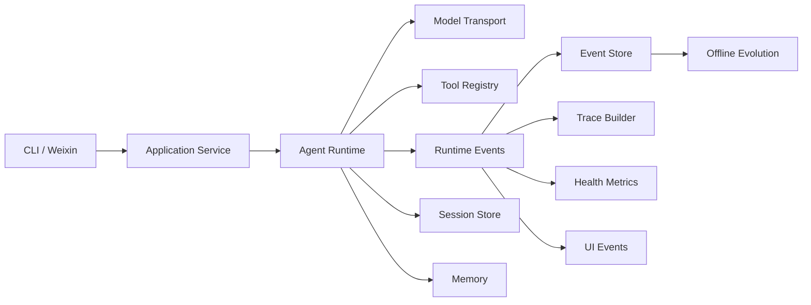

# Architecture

Navi Agent keeps a small runtime-centered architecture. Protocol adapters and
offline evolution stay outside the core execution loop.

## Responsibilities

### Gateway

Handles protocol polling, message normalization, access policy, and outbound
delivery. The current gateway implementation supports Weixin only.

### Application service

Assembles runtime dependencies and exposes use-case-level operations to the CLI
and gateway without leaking storage details.

### Runtime

Owns session loading, context construction, model calls, tool dispatch,
steering, cancellation, compaction, and final responses.

### Tools

Expose capabilities through explicit schemas and results. Tools validate their
inputs, but approval and execution policy remain in the runtime.

### Runtime events

`RuntimeEvent` is the fact stream for execution. Subscribers persist events or
derive traces, health data, and user-facing progress without coupling those
views to the runtime loop.

### Memory and sessions

The session store is authoritative for conversation history. Memory provides
cross-session recall and remains user-scoped.

### Evolution

Consumes stored evidence to propose and govern prompt or skill candidates. It
does not mutate the live runtime path directly.

Skill production and Skill evaluation are separate responsibilities. Agent,
human, and external Skills enter the same inactive draft store. Admission only
checks package structure and provenance. A/B evaluation then runs the active
Skill set as the baseline and the admitted draft as the variant in isolated
temporary stores. Activation is a final explicit operation and requires the
recorded `skill_ab` result.

`REVIEW.html` is a static review artifact. Reviewers can compare outputs, mark
Baseline/Variant/Tie, attribute problems, and download `feedback.json`. That
feedback informs later diagnosis or Skill revision; it does not activate a
draft or modify the runtime.
