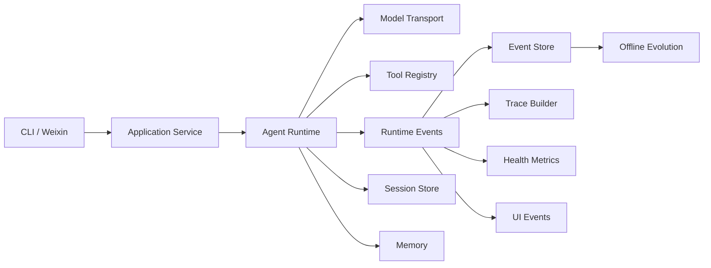

# Architecture

Navi Agent keeps a small runtime-centered architecture. Protocol adapters and
offline evolution stay outside the core execution loop.

## Responsibilities

### Gateway

Handles protocol polling, message normalization, access policy, and outbound
delivery. The current gateway implementation supports Weixin only.

### Application service

Assembles runtime dependencies and exposes use-case-level operations to the CLI
and gateway without leaking storage details.

### Runtime

Owns session loading, context construction, model calls, tool dispatch,
steering, cancellation, compaction, and final responses.

Each runtime is composed with an immutable `EnvironmentBinding`. It gives the
workspace and execution boundary a stable identity across session records,
events, tool calls, and default subagents. The current binding declares host
execution; workspace validation must not be interpreted as an operating-system
sandbox.

Before each agent model call, the runtime persists an immutable `StepSnapshot`.
It binds a unique step identity to the selected model and environment, hashes of
the exact context and tool-schema projections, visible capability names, and
prompt-source identities. The same `step_id` is carried by the model request,
tool context, and runtime events for that iteration.

Each tool call is also represented by a durable `OperationRecord`. It binds the
originating Step and Environment to a stable `operation_id`, capability name,
and argument/result hashes. Its constrained lifecycle is `planned → running →
succeeded|failed|awaiting_input`; an awaiting operation may return to `running`
when the user resolves its interaction. Completed operations are reused by
`(run_id, tool_call_id)` instead of executing the same side effect again.

### Tools

Expose capabilities through explicit schemas and results. Tools validate their
inputs, but approval and execution policy remain in the runtime.

### Runtime events

`RuntimeEvent` is the fact stream for execution. Subscribers persist events or
derive traces, health data, and user-facing progress without coupling those
views to the runtime loop.

The `step.snapshot` event exposes the non-sensitive projection metadata needed
for diagnosis. Offline replay compares its recorded context and tool-schema
hashes with the replayed request and reports projection divergence instead of
silently accepting a different request.

The local Trace Viewer is a read-only telemetry projection. It reads the event
and trace stores to display sessions, true event order, and Skill loading; it
does not participate in runtime execution or mutate recorded state.

### Memory and sessions

The session store is authoritative for conversation history. Memory provides
cross-session recall and remains user-scoped.

Step snapshots are also stored with the run in both session-store
implementations, so the request boundary remains inspectable independently of
event-store projections.

Operation records use the existing tool-execution storage boundary. Both
session-store implementations expose terminal and incomplete operations, which
makes interrupted `planned` or `running` work visible without coupling recovery
policy to individual tools.

### Evolution

Consumes stored evidence to propose and govern prompt or skill candidates. It
does not mutate the live runtime path directly.

Skill production and Skill evaluation are separate responsibilities. Agent,
human, and external Skills enter the same inactive draft store. Admission only
checks package structure and provenance. A/B evaluation then runs the active
Skill set as the baseline and the admitted draft as the variant in isolated
temporary stores. Activation is a final explicit operation and requires the
recorded `skill_ab` result.

`REVIEW.html` is a static review artifact. Reviewers can compare outputs, mark
Baseline/Variant/Tie, attribute problems, and download `feedback.json`. That
feedback informs later diagnosis or Skill revision; it does not activate a
draft or modify the runtime.
