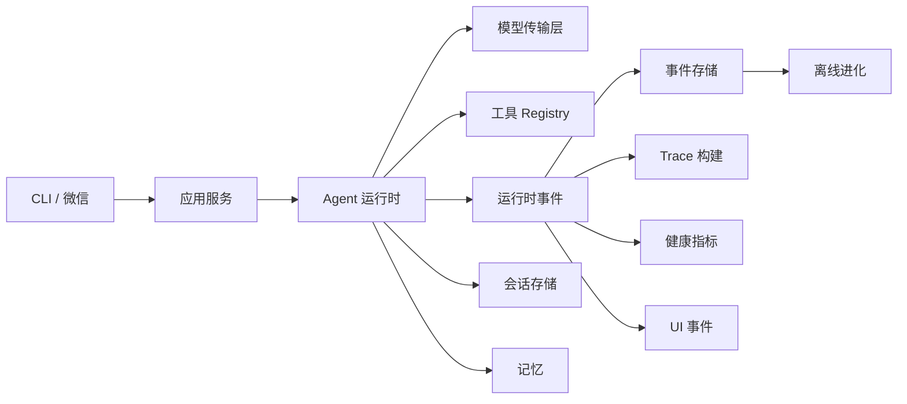

# 架构

Navi Agent 保持以运行时为中心的小型架构。协议适配器和离线进化与核心执行循环分离。

## 职责

### 网关

负责协议轮询、消息标准化、访问策略和出站发送。当前网关实现仅支持微信。

### 应用服务

组装运行时依赖，并向 CLI 和网关暴露用例级操作，不泄漏存储细节。

### 运行时

负责会话加载、上下文构建、模型调用、工具分发、Steering、取消、压缩和最终响应。

### 工具

通过明确的 Schema 和结果暴露能力。工具校验自身输入，审批和执行策略仍由运行时负责。

### 运行时事件

`RuntimeEvent` 是执行事实流。Subscriber 负责持久化事件，或派生 Trace、健康数据和
面向用户的进度，避免这些视图与运行时循环耦合。

### 记忆与会话

会话存储是对话历史的权威来源。记忆提供跨会话 Recall，并按用户隔离。

### 进化

消费已存储的证据，提出并治理 Prompt 或 Skill 候选项。它不会直接修改在线运行时链路。

Skill 生产与 Skill 评测属于两个独立职责。Agent 自主生成、人工编写和外部提供的
Skill 都进入同一个未激活的草稿区。准入只检查包结构与来源；A/B 评测随后在隔离的
临时 Skill Store 中，以当前已激活集合为 Baseline、已准入草稿为 Variant。激活是
最后一个显式操作，并且必须已有记录的 `skill_ab` 结果。

`REVIEW.html` 是静态评审产物。评审者可以对比输出、选择 Baseline/Variant/Tie、
标注问题归因并下载 `feedback.json`。反馈只用于后续归因或修改 Skill，不会激活草稿，
也不会修改在线运行时。
